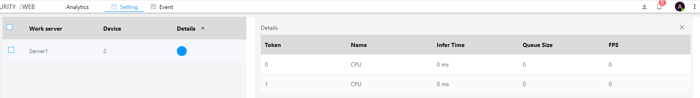
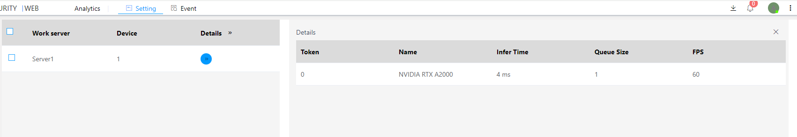

#### Introduction To The Installation Of Video Analysis Service

The system installation package comes with inference model files and supporting libraries based on Intel CPUs by default. Deep learning inference based on Intel CPUs only supports Windows.

Enter **Analysis-》Settings-》Inference Service Configuration** to set the inference engine and model accuracy.USC_ANALYTICS_CPU is inference based on Intel CPU, and USC_ANALYTICS_CUDA is inference based on NVIDIA CUDA.After modifying the engine or model accuracy, you need to restart the system.

The models tested by NVIDIA GPU are NVIDIA RTX 4000 SFF/NVIDIA RTX A2000 6G/NVIDIA RTX 3060, which support multiple GPUs of the same model in a single server.

After the analysis configuration is complete, enter  **Analysis-》Settings-》Inference Service Status** to view the real-time status of the inference service, including inference time/inference queue length/frame rate. CPU-based inference time can be relatively long, and if the inference queue is large, it indicates that the inference resources have been exhausted. Refer to the following figure:

