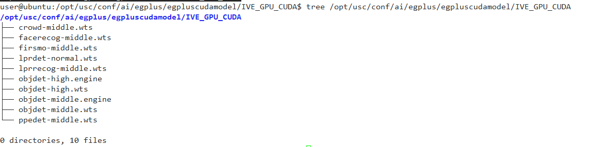
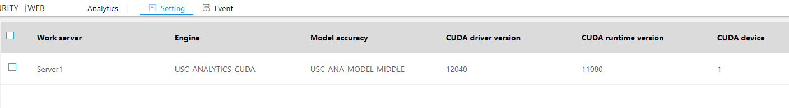
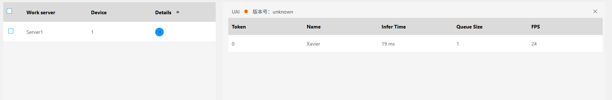
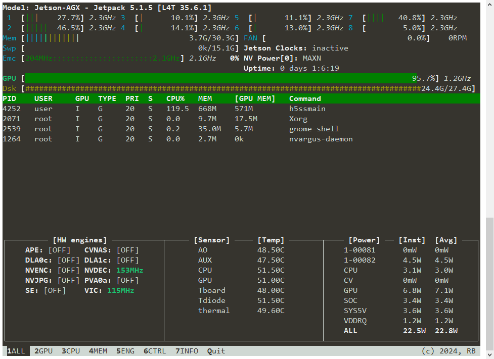

#### Jetson CUDA Inference

The system requires Jetson hardware. JetPack comes pre-installed with CUDA and Tensorrt and retrieves model files. The verified Jetson version is Ubuntu 20.04 JetPack version 5.1.5, and CUDA version 11.8 needs to be upgraded.

JetPack version reference: https://developer.nvidia.com/embedded/jetpack-sdk-515

#### Upgrade CUDA

JetPack version 5.1.5 comes with CUDA 11.4 pre-installed. You need to upgrade from 11.4 to 11.8. Please refer to the following link for instructions.

https://developer.nvidia.com/cuda-11-8-0-download-archive?target_os=Linux&target_arch=aarch64-jetson&Compilation=Native&Distribution=Ubuntu&target_version=20.04&target_type=deb_local

The operation method is as follows:

wget https://developer.download.nvidia.com/compute/cuda/repos/ubuntu2004/arm64/cuda-ubuntu2004.pin

sudo mv cuda-ubuntu2004.pin /etc/apt/preferences.d/cuda-repository-pin-600

wget https://developer.download.nvidia.com/compute/cuda/11.8.0/local_installers/cuda-tegra-repo-ubuntu2004-11-8-local_11.8.0-1_arm64.deb

sudo dpkg -i cuda-tegra-repo-ubuntu2004-11-8-local_11.8.0-1_arm64.deb

sudo cp /var/cuda-tegra-repo-ubuntu2004-11-8-local/cuda-*-keyring.gpg /usr/share/keyrings/

sudo apt-get update

sudo apt-get -y install cuda

#### Installation Of Model Files

 Contact technical support to obtain the model file package egplus.zip, and place the files in egplus/egpluscudamodel into the modules/ai/egplus/egpluscudamodel directory. The final directory structure is as follows:

After installation, restart the USC service, enter Analysis-》Settings-》Inference Service Configuration, and you can see the CUDA driver version and CUDA runtime version. Refer to the following figure:

The system will generate optimized models based on the GPU model when it is first started. After about 5 minutes, there will be a prompt in the Analyze-》Settings-》Inference Service Status. Refer to the following figure:

#### jtop Status

Once the model is running, you can use jtop to check the GPU decoding and inference performance.

