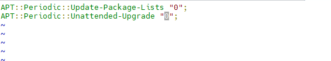
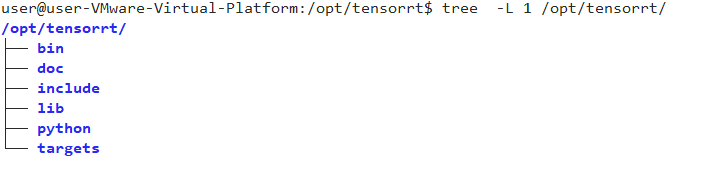
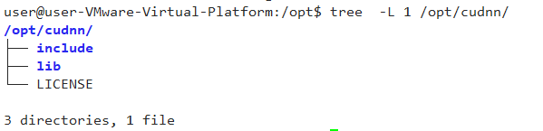

#### Linux CUDA Inference

  The system requires a CUDA-related runtime environment, the installation of the CUDA driver and TensorRT support library, and the acquisition of model files. The Linux verification version is Ubuntu 24.04.4 LTS x86_64.

#### Ubuntu Turn Off Kernel Auto Update

 The installed driver is related to the operating system kernel. If the operating system kernel is updated, the driver will become invalid. Therefore, it is necessary to disable automatic kernel updates.Take Ubuntu 24.4 as an example.

 sudo systemctl disable --now unattended-upgrades

 sudo systemctl status unattended-upgrades

 sudo vi /etc/apt/apt.conf.d/20auto-upgrades

cat /etc/apt/apt.conf.d/20auto-upgrades

APT::Periodic::Update-Package-Lists "0";

APT::Periodic::Unattended-Upgrade "0";

#### Install CUDA Driver For Linux

 The CUDA driver comes with its own GPU driver, so there is no need to install the GPU driver separately before installing the CUDA driver.The currently used version of CUDA is cuda_13.2.2_595.71.05_linux.run .
 You can enter the following link to download https://developer.nvidia.com/cuda-downloads    
 You can also directly click the link below to download:
https://developer.download.nvidia.com/compute/cuda/13.2.2/local_installers/cuda_13.2.2_595.71.05_linux.run 
  
After downloading, refer to the following commands to install it. Install the GPU driver during installation.
sudo ./cuda_13.2.2_595.71.05_linux.run
If the installation fails, you can replace tmpdir and install again.
sudo ./cuda_13.2.2_595.71.05_linux.run --tmpdir=/home/user/tmp 
The nvidia-smi command allows you to check the CUDA version supported by the driver.

#### Linux Tensorrt and cudnn Support Library Installation

   Download TensorRT-10.16.1.11.Linux.x86_64-gnu.cuda-13.2.tar
https://developer.nvidia.com/downloads/compute/machine-learning/tensorrt/10.16.1/tars/TensorRT-10.16.1.11.Linux.x86_64-gnu.cuda-13.2.tar.gz .
 Extract the package to /opt/tensorrt. The final directory structure is as follows:

   Download cudnn-linux-x86_64-9.20.0.48_cuda13-archive.tar.xz
https://developer.download.nvidia.com/compute/cudnn/redist/cudnn/linux-x86_64/cudnn-linux-x86_64-9.20.0.48_cuda13-archive.tar.xz
 Extract the package to /opt/cudnn. The final directory structure is as follows:

#### Installation Of Model Files

 Contact technical support to obtain the model file package egplus.zip, and place the files in egplus/egpluscudamodel into the conf/ai/egplus/egpluscudamodel directory. The final directory structure is as follows:

After installation, restart the USC service, enter Analysis-》Settings-》Inference Service Configuration, and you can see the CUDA driver version and CUDA runtime version. Refer to the following figure:

The system will generate optimized models based on the GPU model when it is first started. After about 5 minutes, there will be a prompt in the Analyze-》Settings-》Inference Service Status. Refer to the following figure:

