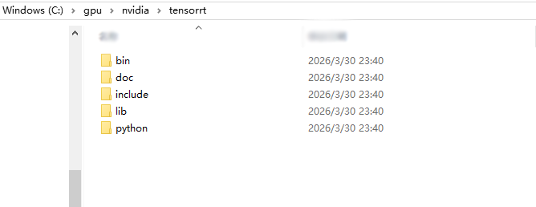
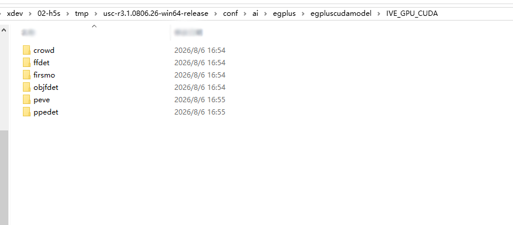

#### Windows CUDA Inference

 The system requires a CUDA-related runtime environment, installation of the CUDA driver and TensorRT support library, and acquisition of model files.

#### Install the CUDA Driver For Windows

 The CUDA driver does not include the GPU driver, so the GPU driver must be installed separately before installing the CUDA driver. Starting from r4.0, CUDA version 13.2 is used.
 You can access the following link to download https://developer.nvidia.com/cuda-downloads    
 You can also directly click the following link to download:
https://developer.download.nvidia.com/compute/cuda/13.2.2/local_installers/cuda_13.2.2_windows.exe
  
  After downloading, simply install it using the default configuration.
  The nvidia-smi command allows you to check the CUDA version supported by the driver.

#### Installation Of Windows TensorRT and cudnn Support Library

  Download TensorRT 10.16.1.11
https://developer.download.nvidia.com/compute/machine-learning/tensorrt/10.16.1/zip/TensorRT-10.16.1.11.Windows.amd64.cuda-13.2.zip 
  Extract the package to C:\gpu\nvidia\tensorrt. The final directory structure is as follows:

  Download cudnn 9.20.0.48
https://developer.download.nvidia.com/compute/cudnn/redist/cudnn/windows-x86_64/cudnn-windows-x86_64-9.20.0.48_cuda13-archive.zip
  Extract the package to C:\gpu\nvidia\cudnn. The final directory structure is as follows:

#### Model File Installation

 Contact technical support to obtain the model file package egplus.zip, and place the files in egplus\egpluscudamodel into the modules\ai\egplus\egpluscudamodel directory. The final directory structure is as follows:

After the installation is complete, restart the USC service and navigate to Analysis-》Settings-》Inference Service Configuration. You should be able to view the CUDA driver version and the CUDA runtime version. Please refer to the figure below for reference:

The system will generate an optimized model based on the GPU model during the first startup, which takes about 5 minutes. There will be a prompt in the Analyze-》Settings-》Inference Service Status, as shown in the following figure:

