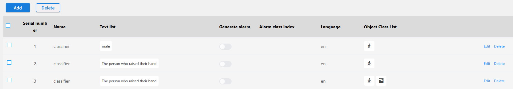
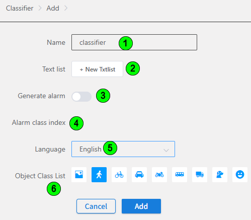

#### Classifier

#### Operation Steps

Go to **Analyics-》Setting-》Classifier**

| Number | Name         | Function                 |
| ------ | ------------ | ------------------------ |
| 1      | Name         | Device name              |
| 2      | Text list    | Text list          |
| 3      | Generate alarm     | Whether to Generate Alarm         |
| 4      | Alarm class index           | Alarm Category Index        |
| 5      | Language         | Language (zh, en)          |
| 6      | Object Class List        | Target Objects to Check (background, person, bicycle, car, motorcycle, bus, truck, dog, face) |
