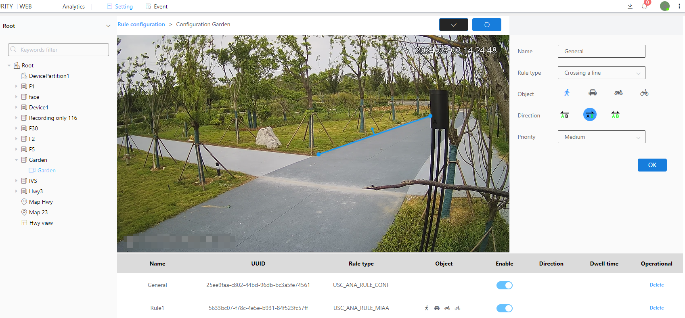

#### Crossing Line Inspection

Area intrusion is the detection of object movement in a given direction, and the direction for triggering an alarm can be configured.

1\. Select the inspection type as Mixing Line Inspection

2\. Select the object for mixing line detection

3\. Select the detection direction

 (The first direction A is green, indicating that A is out and B is in)

 (The second direction B is green, indicating that B is out and A is in)

 (The third direction AB is green, indicating that both AB are in and out.)

4\. Select level

5\. Click the Brush button to draw a frame in the image.After drawing the frame, you need to click the brush button to confirm that the frame is drawn

6\. Next to the Brush button is the Restore button, which restores the frameless state

7\. Finally click the OK button