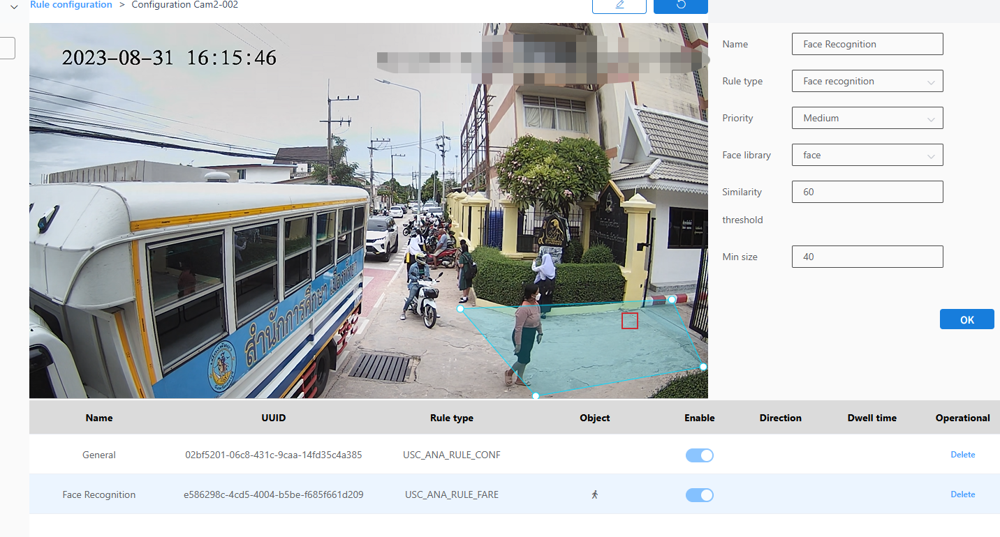

#### Face Recognition

1\. Select Face Recognition as the check type.

2.Choose the level.

3.Select the face database.

4.Enter the similarity threshold.

5.Enter the minimum size.

6.Click the Brush button and draw a frame on the image. After drawing the frame, you need to click the Brush button again to confirm the frame is completed.

7.Next to the Brush button is the Restore button, which reverts to the state where no frame was drawn.

8.Finally, click the OK button.