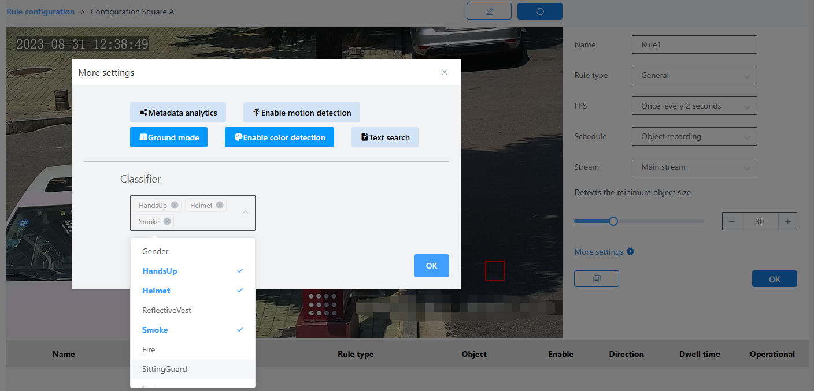

#### Introduction To Basic Rules

The basic rule is to set the analysis parameters of the channel, and all other analysis rules for that channel are based on these parameters. The polygon set by the basic rule defines the scope of the analysis, and only objects within that polygon will be calculated.If the inference engine is set to USC_ANALYTICS_CPU (i.e., CPU mode), the maximum frame rate is 5 frames. If the setting is greater than 5 frames, it will be forced to 5 frames.

Rule configuration:

1\. Select the device under the root node, and click on the configuration under the edit field on the right side of the interface

2\. Custom name

3\. Select the check type as Basic Configuration

4\. Customize the frame rate or use the default frame rate

5\. Select a plan

6\. Open metadata analysis

7\. Select the code stream

8\. Adjust the minimum object size for detection

9\. Configure more settings

10\. Click the Brush button to draw a frame in the image.After drawing the frame, you need to click the brush button to confirm that the frame is drawn

11\. Next to the Brush button is the Restore button, which restores the frameless state

12\. Finally click the OK button

