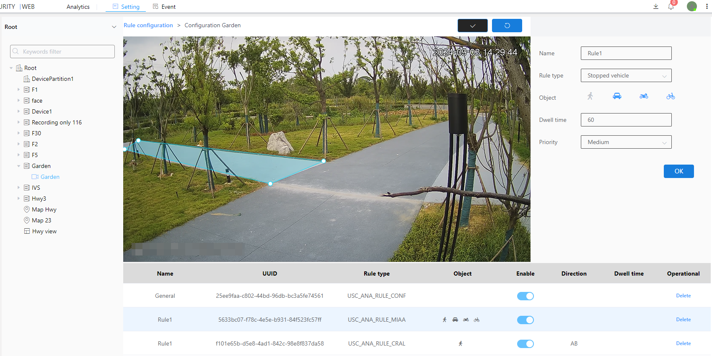

#### Illegal parking

Illegal parking is an algorithm that detects cars/motorcycles/bicycles staying in a given area.

1\. Select the type of inspection as illegal parking

2\. Select the detection object of illegal parking

3\. Customize or use the default dwell time, unit: seconds

4\. Select level

5\. Click the Brush button to draw a frame in the image.After drawing the frame, you need to click the brush button to confirm that the frame is drawn

6\. Next to the Brush button is the Restore button, which restores the frameless state

7\. Finally click the OK button