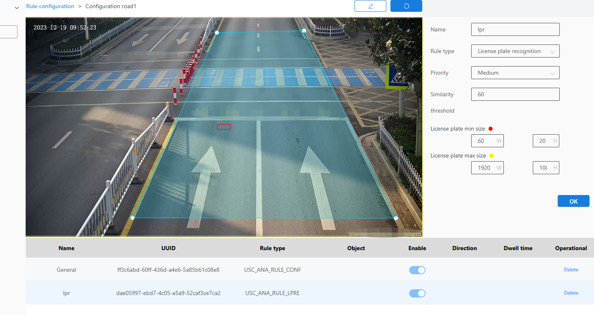

#### License plate recognition

License plate recognition is the process of detecting the license plate rules of vehicles within a given range.

1.Select License Plate Recognition as the check type.

2.Choose the level.

3.Enter the similarity threshold.

4.Enter the minimum and maximum sizes of the license plate.

5.Click the Brush button and draw a frame on the image. After drawing the frame, you need to click the Brush button again to confirm that the frame is completed.

6.Next to the Brush button is the Restore button, which restores the state to before any frame was drawn.

7.Finally, click the OK button.