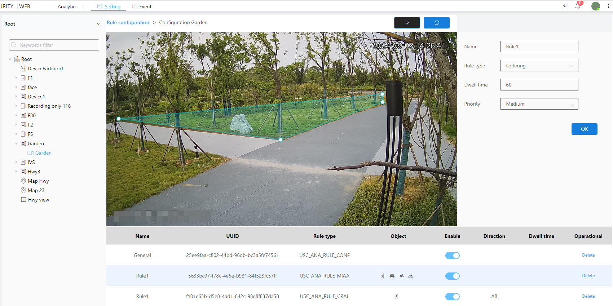

#### Loitering

Loitering is an algorithm that detects people staying in a given area for a certain period of time.

1\. Select the inspection type as Personnel Stay

2\. Customize or use the default dwell time, in seconds

3\. Select level

4\. Click the Brush button to draw a frame in the image.After drawing the frame, you need to click the brush button to confirm that the frame is drawn

5\. Next to the Brush button is the Restore button, which restores the frameless state

6\. Finally click the OK button