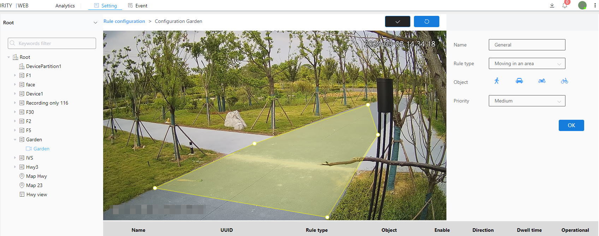

#### Area Intrusion

Area intrusion is a rule for detecting active objects within a given range.

1\. Select the inspection type as area intrusion

2\. Select the intrusion object (person, car, motorcycle, bicycle)

3\. Select level

4\. Click the Brush button to draw a frame in the image.After drawing the frame, you need to click the brush button to confirm that the frame is drawn

5\. Next to the Brush button is the Restore button, which restores the frameless state

6\. Finally click the OK button