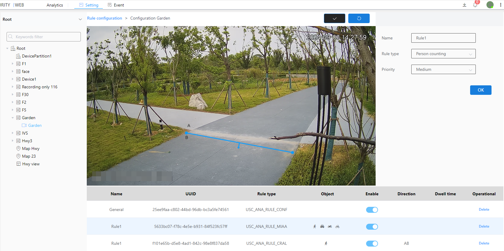

#### People Counting

People Counting is the statistics of the total number of people who have passed through a certain direction.

1\. Select the inspection type as Person Counting

2\. Select level

3\. Refer to steps 9, 10, and 11 of the Basic Configuration

4\. Click the Brush button to draw a frame in the image.After drawing the frame, you need to click the brush button to confirm that the frame is drawn

5\. Next to the Brush button is the Restore button, which restores the image to its original state without a frame

6\. Finally click the OK button