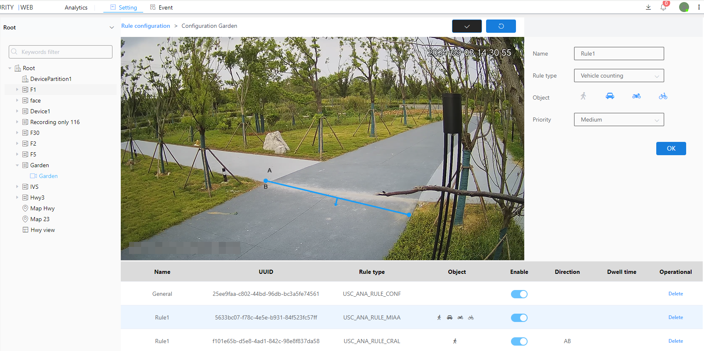

#### Vehicle Counting

 Vehicle counting is the statistics of the total number of vehicles passing through a given direction.

1\. Select the vehicle counting as the inspection type

2\. Select the detection object for vehicle counting

3\. Select level

4\. Click the Brush button to draw a frame in the image.After drawing the frame, you need to click the brush button to confirm that the frame is drawn

5\. Next to the Brush button is the Restore button, which restores the frameless state

6\. Finally click the OK button