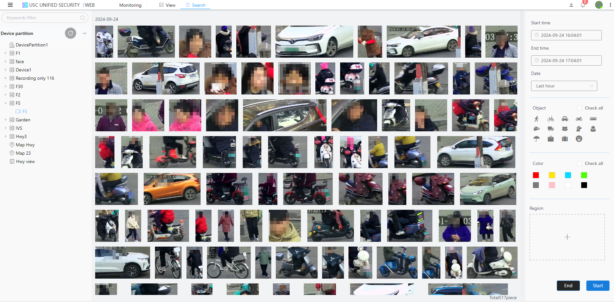
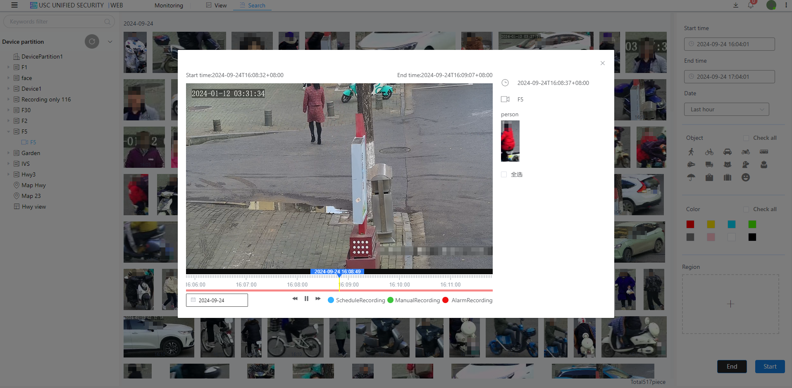

#### AI Search

The video database can store metadata for deep learning inference, thereby enabling data structuring. Users can quickly search for metadata, thereby enabling post-event rapid retrieval functions.Enter **View-》Device Partition-》Root Node** to select the device to search, and then modify the search criteria,

The parameters that can be modified include: time, object type, color, and the area where the object is located.Refer to the following figure:

If you need to view the detailed information of an object, you can click on the object and a playback window for the object will pop up. Refer to the following figure:

